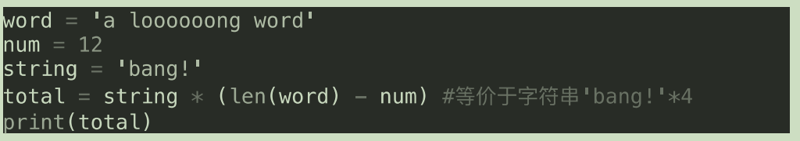

<!-- TOC -->

- [Python环境的搭建](#python%E7%8E%AF%E5%A2%83%E7%9A%84%E6%90%AD%E5%BB%BA)
    - [python安装](#python%E5%AE%89%E8%A3%85)
    - [IDE安装](#ide%E5%AE%89%E8%A3%85)
- [变量和字符串](#%E5%8F%98%E9%87%8F%E5%92%8C%E5%AD%97%E7%AC%A6%E4%B8%B2)
    - [基本概念](#%E5%9F%BA%E6%9C%AC%E6%A6%82%E5%BF%B5)
    - [字符串的分片与索引](#%E5%AD%97%E7%AC%A6%E4%B8%B2%E7%9A%84%E5%88%86%E7%89%87%E4%B8%8E%E7%B4%A2%E5%BC%95)

<!-- /TOC -->

# Python环境的搭建

## python安装
- Windows平台
1. 官网下载安装包
2. 点击安装时，注意勾选将python添加到环境变量
- Mac平台
1. 官网下载安装包
2. 点击安装
---
1. 提前安装好homebrew
2. 输入命令`brew install python3`
- Linux平台
1. Debian系列
> apt-get install python3
2. RedHat系列
> yum install python3

## IDE安装
> - 官网下载pycharm社区版,免费使用

# 变量和字符串
## 基本概念
- 变量要赋值使用，大小写敏感
- 用print(a)可以打印出变量内容
- 字符串：用单（双）引号括起来的内容
- 可以适用连接符`+`，来链接字符串内容，形成新的字符串
- 连接符左右两个单元，必须是字符串或字符，类型要一致
- 如果想要知道变量是啥类型，可以用print(type(a)),打印出来
- 为了防止，中文注释出现乱码，可以开头声明`#coding:utf-8`，或者编辑器设置编码。
- 如果想要类型一致，可以用强制类型转换，如int（a）就是把a变量变成整型
- 字符串还可以乘上数字，就变成了好几个内容
```python
words='words'*3
print(words)*3
wordswordswords
```
- 可以适用len（a）来测量出a字符串的长度，是整型


## 字符串的分片与索引
