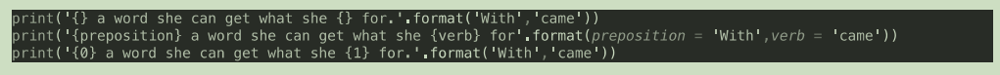

<!-- TOC -->

- [Python环境的搭建](#python%E7%8E%AF%E5%A2%83%E7%9A%84%E6%90%AD%E5%BB%BA)
    - [python安装](#python%E5%AE%89%E8%A3%85)
    - [IDE安装](#ide%E5%AE%89%E8%A3%85)
- [变量和字符串](#%E5%8F%98%E9%87%8F%E5%92%8C%E5%AD%97%E7%AC%A6%E4%B8%B2)
    - [基本概念](#%E5%9F%BA%E6%9C%AC%E6%A6%82%E5%BF%B5)
    - [字符串的分片与索引](#%E5%AD%97%E7%AC%A6%E4%B8%B2%E7%9A%84%E5%88%86%E7%89%87%E4%B8%8E%E7%B4%A2%E5%BC%95)
    - [字符串格式化输入](#%E5%AD%97%E7%AC%A6%E4%B8%B2%E6%A0%BC%E5%BC%8F%E5%8C%96%E8%BE%93%E5%85%A5)
- [函数](#%E5%87%BD%E6%95%B0)
    - [内置函数](#%E5%86%85%E7%BD%AE%E5%87%BD%E6%95%B0)
    - [自建函数](#%E8%87%AA%E5%BB%BA%E5%87%BD%E6%95%B0)
    - [函数习题](#%E5%87%BD%E6%95%B0%E4%B9%A0%E9%A2%98)
    - [传递参数和参数类型](#%E4%BC%A0%E9%80%92%E5%8F%82%E6%95%B0%E5%92%8C%E5%8F%82%E6%95%B0%E7%B1%BB%E5%9E%8B)
        - [分类](#%E5%88%86%E7%B1%BB)
        - [习题](#%E4%B9%A0%E9%A2%98)
    - [需要知道的运算符](#%E9%9C%80%E8%A6%81%E7%9F%A5%E9%81%93%E7%9A%84%E8%BF%90%E7%AE%97%E7%AC%A6)
- [逻辑控制与循环](#%E9%80%BB%E8%BE%91%E6%8E%A7%E5%88%B6%E4%B8%8E%E5%BE%AA%E7%8E%AF)

<!-- /TOC -->

# Python环境的搭建

## python安装
- Windows平台
1. 官网下载安装包
2. 点击安装时，注意勾选将python添加到环境变量
- Mac平台
1. 官网下载安装包
2. 点击安装
---
1. 提前安装好homebrew
2. 输入命令`brew install python3`
- Linux平台
1. Debian系列
> apt-get install python3
2. RedHat系列
> yum install python3

## IDE安装
> - 官网下载pycharm社区版,免费使用

# 变量和字符串

## 基本概念
- 变量要赋值使用，大小写敏感
- 用print(a)可以打印出变量内容
- 字符串：用单（双）引号括起来的内容
- 可以适用连接符`+`，来链接字符串内容，形成新的字符串
- 连接符左右两个单元，必须是字符串或字符，类型要一致
- 如果想要知道变量是啥类型，可以用print(type(a)),打印出来
- 为了防止，中文注释出现乱码，可以开头声明`#coding:utf-8`，或者编辑器设置编码。
- 如果想要类型一致，可以用强制类型转换，如int（a）就是把a变量变成整型
- 字符串还可以乘上数字，就变成了好几个内容
```python
words='words'*3
print(words)*3
wordswordswords
```
- 可以适用len（a）来测量出a字符串的长度，是整型


## 字符串的分片与索引


- 类似于数组的索引
- `name[11,14]`的意思是从11个开始，不包含14的切片
- `name[5:]`代表从5到结尾
- `name[:5]`代表从开头到5,不包含5

- 输出的结果是`fiend`

- 输出结果为`*********0006`
- replace是替换的一个字符串方法

- find是字符串的搜索方法，返回初始位置

## 字符串格式化输入
- 下面三个方法都用format方法来格式化输入

- 下面是用百度天气的api开发片段


# 函数

## 内置函数

- python3.5 内置了上面的这些函数

## 自建函数
```python
def fuction(arg1,arg2):
    ...
    ...
    return result
```
- 下面是摄氏度转华氏度的函数自定义

- 如果我们要调用上面的函数

运行完，就会得到想要的结果

## 函数习题

- 第一题答案
```python
def fuction(weight):
    result=weight/1000
    return result
print(fuction(56))
```
- 第二题答案
```python
def fuction(a,b):
    result=pow(pow(a,2)+pow(b,2),.5)
    return result
print('The Right triangle thrid side \' length is '+str(fuction(3,4)))
```

## 传递参数和参数类型

### 分类
1. 位置参数
- area(1,2,3)
2. 关键字参数
- area(base_up=1,base_down=2,height=3)

1. 完全是关键字参数，无关排序
2. 当到3的时候，变成位置参数，对应height，但是height在之前已经输入过了
3. 参考第二条语句，参数都正确的输入了
4. 当到3的时候，变成关键字参数，输入无误
- **无论什么参数，只要函数定义了，输入时就缺一不可**
- **除非我们在定义函数的时候，定义了默认值**
- **即使设置了默认值，调用时任然可以自己更改**
```python
print('  *',' **','***',' | ')
print('  *',' **','***',' | ',sep='\n' )
```
- 默认逗号是空格间隔，但是如果改成换行，就会变成一棵树

### 习题
- 打开桌面上的文件，同时写入内容，输入：1.文件名2.写入内容，输出提示完成

- `'w'`代表写入模式，如果该位置有文件就覆盖，没有就创建
- 打开文件，使用完就要关闭文件

## 需要知道的运算符

|符号|描述|
|---|---|
|%|返回余数|
|**|次方运算符|
|//|返回商的整数部分|

# 逻辑控制与循环