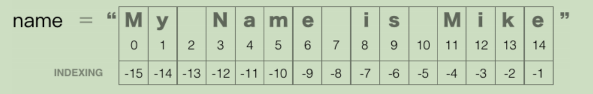
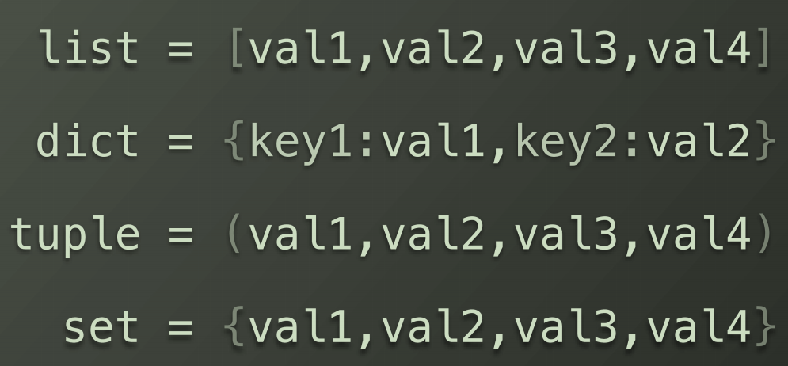

- [学习文档](#学习文档)
- [Python环境的搭建](#python环境的搭建)
  - [python安装](#python安装)
  - [2. 点击安装](#2-点击安装)
  - [IDE安装](#ide安装)
- [变量和字符串](#变量和字符串)
  - [基本概念](#基本概念)
  - [字符串的分片与索引](#字符串的分片与索引)
  - [字符串格式化输入](#字符串格式化输入)
- [函数](#函数)
  - [内置函数](#内置函数)
  - [自建函数](#自建函数)
  - [函数习题](#函数习题)
  - [传递参数和参数类型](#传递参数和参数类型)
    - [分类](#分类)
    - [习题](#习题)
  - [需要知道的运算符](#需要知道的运算符)
- [逻辑控制与循环](#逻辑控制与循环)
  - [布尔类型](#布尔类型)
  - [逻辑运算符](#逻辑运算符)
    - [常见的相同比较类型](#常见的相同比较类型)
    - [不同类型的比较](#不同类型的比较)
    - [布尔类型的比较](#布尔类型的比较)
  - [成员运算符和身份运算符](#成员运算符和身份运算符)
    - [列表](#列表)
      - [创建列表](#创建列表)
      - [添加元素](#添加元素)
      - [访问元素](#访问元素)
  - [布尔运算](#布尔运算)
    - [bool（）](#bool)
    - [None](#none)
    - [运算符](#运算符)
  - [条件控制if---else](#条件控制if---else)
  - [循环](#循环)
    - [for循环基本格式](#for循环基本格式)
    - [嵌套循环](#嵌套循环)
    - [while循环](#while循环)
    - [练习](#练习)
  - [综合练习](#综合练习)
- [数据结构](#数据结构)
  - [列表](#列表-1)
    - [列表的访问](#列表的访问)
  - [字典](#字典)
    - [字典的访问](#字典的访问)
  - [元组](#元组)
  - [集合](#集合)
  - [数据结构的相关技巧](#数据结构的相关技巧)
    - [排序](#排序)
    - [两个列表的循环](#两个列表的循环)
    - [推导式](#推导式)
  - [综合项目-字频统计](#综合项目-字频统计)
- [类](#类)
  - [定义](#定义)
  - [实例化](#实例化)
  - [在类中定义函数](#在类中定义函数)
  - [类的初始化函数](#类的初始化函数)
    - [初始化函数的其他参数](#初始化函数的其他参数)
  - [类的继承](#类的继承)
- [使用第三方库](#使用第三方库)
  - [查找](#查找)
  - [安装](#安装)
    - [Pycharm安装](#pycharm安装)
    - [pip工具安装](#pip工具安装)
    - [手动安装](#手动安装)

# 学习文档
[Python课程](./Python入门书.pdf)
# Python环境的搭建

## python安装
- Windows平台
1. 官网下载安装包
2. 点击安装时，注意勾选将python添加到环境变量
- Mac平台
1. 官网下载安装包
2. 点击安装
---
1. 提前安装好homebrew
2. 输入命令`brew install python3`
- Linux平台
1. Debian系列
> apt-get install python3
2. RedHat系列
> yum install python3

## IDE安装
> - 官网下载pycharm社区版,免费使用

# 变量和字符串

## 基本概念
- 变量要赋值使用，大小写敏感
- 用print(a)可以打印出变量内容
- 字符串：用单（双）引号括起来的内容
- 可以适用连接符`+`，来链接字符串内容，形成新的字符串
- 连接符左右两个单元，必须是字符串或字符，类型要一致
- 如果想要知道变量是啥类型，可以用print(type(a)),打印出来
- 为了防止，中文注释出现乱码，可以开头声明`#coding:utf-8`，或者编辑器设置编码。
- 如果想要类型一致，可以用强制类型转换，如int（a）就是把a变量变成整型
- 字符串还可以乘上数字，就变成了好几个内容
```python
words='words'*3
print(words)*3
wordswordswords
```
- 可以适用len（a）来测量出a字符串的长度，是整型


## 字符串的分片与索引


- 类似于数组的索引
- `name[11,14]`的意思是从11个开始，不包含14的切片
- `name[5:]`代表从5到结尾
- `name[:5]`代表从开头到5,不包含5

- 输出的结果是`fiend`

- 输出结果为`*********0006`
- replace是替换的一个字符串方法

- find是字符串的搜索方法，返回初始位置

## 字符串格式化输入
- 下面三个方法都用format方法来格式化输入

- 下面是用百度天气的api开发片段


# 函数

## 内置函数

- python3.5 内置了上面的这些函数

## 自建函数
```python
def fuction(arg1,arg2):
    ...
    ...
    return result
```
- 下面是摄氏度转华氏度的函数自定义

- 如果我们要调用上面的函数

运行完，就会得到想要的结果

## 函数习题

- 第一题答案
```python
def fuction(weight):
    result=weight/1000
    return result
print(fuction(56))
```
- 第二题答案
```python
def fuction(a,b):
    result=pow(pow(a,2)+pow(b,2),.5)
    return result
print('The Right triangle thrid side \' length is '+str(fuction(3,4)))
```

## 传递参数和参数类型

### 分类
1. 位置参数
- area(1,2,3)
2. 关键字参数
- area(base_up=1,base_down=2,height=3)

1. 完全是关键字参数，无关排序
2. 当到3的时候，变成位置参数，对应height，但是height在之前已经输入过了
3. 参考第二条语句，参数都正确的输入了
4. 当到3的时候，变成关键字参数，输入无误
- **无论什么参数，只要函数定义了，输入时就缺一不可**
- **除非我们在定义函数的时候，定义了默认值**
- **即使设置了默认值，调用时任然可以自己更改**
```python
print('  *',' **','***',' | ')
print('  *',' **','***',' | ',sep='\n' )
```
- 默认逗号是空格间隔，但是如果改成换行，就会变成一棵树

### 习题
- 打开桌面上的文件，同时写入内容，输入：1.文件名2.写入内容，输出提示完成

- `'w'`代表写入模式，如果该位置有文件就覆盖，没有就创建
- 打开文件，使用完就要关闭文件

## 需要知道的运算符

| 符号 | 描述             |
| ---- | ---------------- |
| %    | 返回余数         |
| **   | 次方运算符       |
| //   | 返回商的整数部分 |

# 逻辑控制与循环
## 布尔类型

- 只有0和1两个值，也就是false和true
## 逻辑运算符

| 符号 | 描述     |
| ---- | -------- |
| ==   | 判等     |
| !=   | 不等于   |
| >    | 大于     |
| <    | 小于     |
| >=   | 大于等于 |
| <=   | 小于等于 |
### 常见的相同比较类型
1. 常量的比较
2. 变量的比较
3. 字符串的比较，区分大小写
4. 函数的结果比较
### 不同类型的比较
- 不能用>,<,>=,<=进行比较，可以用==，!=进行比较
- 浮点类型和整型可以进行比较
### 布尔类型的比较
- 把false当成0,true当成1,运算完就可以进行比较
## 成员运算符和身份运算符
### 列表
#### 创建列表
1. 空列表`album=[]`
2. 非空列表`album=['Black','david',25,false]`
#### 添加元素
> album.append('new str')
#### 访问元素
- album[0],album[-1]代表第一个和最后一个元素
***
- 所以in可以这样用
> 'Black' in album
- is可以这样用
> album[1] is album[-4]
- is和in可以加上not来否定
## 布尔运算
### bool（）
- 除了0,None和所有空的序列和集合（列表、字典、集合）的布尔值为空，其他都是true.可以用bool（）来判断。
### None
- 如果一个函数没有返回值，却赋值给了一个变量，那么这个变量就是None
- 在定义一个变量的时候，没想好赋值，那么可以赋值为None
### 运算符
- 有一下几个

| 符号 | 描述       |
| ---- | ---------- |
| not  | 否定       |
| and  | 并且的意思 |
| or   | 或者的意思 |
- or 有真则真，and有假则假
## 条件控制if---else
- 一个模拟密码登陆系统
1. 普通思路

2. 布尔值传入判断

- 用elif来模拟密码重置

## 循环
### for循环基本格式

- 一般用法
```python
for num in rang(1,11):
    print(str(num)+'+1=',sum+1)
```
- rang,不包含11,所以是1-10的整数
```python
songslists=['holy','tharuk','rebel]
for song in songslists:
    if song=='holy:
        print(song,'-Dio')
    elif song=='tharuk':
        print(song,'-AC/DC')
    elif song=='rebel':
        print(song,'-david')
```
### 嵌套循环
- 打印乘法口诀表
```python
def fuction():
    tmp=0
    for i in range(1,10):
        for j in range(1,i+1):
            print('{}X{}={}\t'.format(j,i,i*j),end=' ')
        print()
fuction();
```
### while循环
- 基本语法

- while循环要注意，不能死循环
- 可以构成while-else循环结构
```python
tries=3
while tries>0:
    ***
else:
    ***
```
### 练习
1. 设计函数，在桌面上创建10个文本，分别是数字1-10.txt
```python
def fuction():
    for num in range(1,11):
        file=open('/home/keri/Desktop/'+str(num)+'.txt','w')
fuction();
```
2. 编写一个函数，参数包含资金、利率、投资时间，返回投资时间内的每年的金额
```python
def fuction(amount,rate,time):
    for num in range(1,int(time)+1):
        amount = amount * (1+rate/100)
        print("Year{}:${}".format(num,amount))
fuction(100,5,8)
```
3. 打印1-100之内的偶数
```python
def fuction():
    for num in range(1,101):
        if num%2==0:
            print(num,end="\t")
fuction()
```
## 综合练习
1. 随机生成三个数字，让用户去猜大小，大应在11-18之间，小应该在3-10之间
```python
import random
def fuction(str):
    list=[0,0,0]
    list[0] = random.randrange(1,7)
    list[1] = random.randrange(1,7)
    list[2] = random.randrange(1,7)
    if(sum(list)>10):
        result='big'
    else:
        result='small'
    print("the list are [{},{},{}]".format(list[0], list[1], list[2]))
    if(result==str):
        print('you are win')
    else:
        print('you are lose')

str=input('输入：\n')
fuction(str)
```
2. 基于前一个练习，编写一个投注游戏，初始金额1000,赔率默认1,输光为止
```python
import random
def fuction():
    list = [0, 0, 0]
    money=1000
    while money>0:
        print('-----   STSRT   -----')
        str=input('big or small?')
        duzhu=input('how mush you wanna bet?')
        if (0<int(duzhu)<=money):
            list[0] = random.randrange(1, 7)
            list[1] = random.randrange(1, 7)
            list[2] = random.randrange(1, 7)
            if (sum(list) > 10):
                result = 'big'
            else:
                result = 'small'
            print('-----ROLL THE DICE!-----')
            print("the list are [{},{},{}]".format(list[0], list[1], list[2]))
            if (result == str):
                money = money + int(duzhu)
                print('you are win,you gained {}'.format(duzhu))
            else:
                money=money-int(duzhu)
                print('you are lose,you lost {}'.format(duzhu))
            print('you have {} now'.format(money))
        else:
            print('invaild input!')
    else:
        print('-----   OVER    -----')

fuction()
```
3. 检测一个号码是否合法
```python
import random
def fuction(str):
    oper=None
    CN_mobile=[134,135,136,137,138,139,150,151,152,157,158,159,182,183,184,187,188,147,178,1705]
    CN_union=[130,131,132,155,156,185,186,145,176,1709]
    CN_telecom=[133,153,180,181,189,177,1700]
    if len(str)==11:
        if str[:3]=='170':
            if str[3]=='5':
                oper='CN_mobile'
            elif str[3]=='9':
                oper='CN_union'
            elif str[3]=='0':
                oper='CN)_telecom'
        else:
            if int(str[0:3]) in CN_mobile:
                oper = 'CN_mobile'
            elif int(str[0:3]) in CN_union:
                oper = 'CN_union'
            elif int(str[0:3]) in CN_telecom:
                oper = 'CN)_telecom'
        if oper:
            print("Operator:{}".format(oper))
            print('我们将发送验证码到号码：{}'.format(str))
        else:
            print('不是合法的号码')
    else:
        print('不是11位号码，重新输入')
str=input('输入号码：\n')
fuction(str)
```
# 数据结构
- 列表、字典、元组、集合

- 如图所示，列表用中括号，元组是小括号，而字典和集合用的是大括号，不同的是字典是一个键对应一个值，中间用冒号隔开
## 列表
1. 列表中的每个元素都是可变的
2. 列表中的每个元素都是有序的，每个元素都有一个位置
3. 列表可以容纳任何一种对象
### 列表的访问
- 插入 `list.insert(1,'str')`在list[1],list[0]之后插入元素，如果被插入的元素不在列表中，则插到最后。
- `fruit[0:0]='str'`同样可以插入元素，这样就可以把一个切片插到头
- `list.remove('str')`是删除列表中str元素，也可以通过`del list[1:5]`,来删除切片
- `list[4]='str'`是替换掉原本内容
## 字典
1. 数据必须以键-值形式成对出现
2. 键不能重复，值可以重复
3. 键不可变，值却可以改成任何对象
### 字典的访问
- 添加单个元素
`dict['YOUKU']='Youku'`
- 添加多个元素
`dict.update({'FB':'FaceBook','TSLA':'Tesla'})`
- 删除元素,索引字典元素时可以用方括号括键
`del dict['FB']`
- 字典不能切片
## 元组
- 可以看成是一个不可修改的列表
- 可以被查看
## 集合
- 集合不能被切片、索引
- 可以做集合运算
- `set.add(5)`添加元素，`set.discard(5)`删除元素
## 数据结构的相关技巧
### 排序
- 从大到小排序 
`print(sorted(num_list))`
- 逆序排列
`print(sorted(num_list，reverse=True))`
### 两个列表的循环
`for a,b in zip(list_a,list_b):`
- 俩个列表同时开始循环
### 推导式
- 把十个连续的整数加入列表中
```python
a=[]
for i in range(1,11):
    a.append(i)
```
```python
a=[i for i in range(1,11)]
```
- 两个代码实现了同样的功能
- 第二个方法就是列表解析式，不仅方便，而且执行效率比第一种方法高很多
- 计时
```python
import time
t0=time.clock()
......
time.chock()-t0 ##这个计算的结果为前面程序执行所花的时间
```
- 推导式的其他几个列子

- 字典的推导

- 循环时获取索引
```python
letters=['a','b','c','d','d','e','f','g']
for num,letter in enumerater(letters):
    print(letter,'is',num)
## num 就是索引
```
## 综合项目-字频统计

- `strip(string.punctuation).lower()`把包含符号的去掉，并且所有字母转换为小写
- 用set()，把列表转换为集合，就自动去除了重复的元素
- 创建了以单词为键，频率为值的字典
- 最后按照频率大小，即键值大小从小到大来顺序输出字典
# 类
## 定义
- *类是有一些系列有共同特征和行为事务的抽象概念总和*
- 下面都是以可乐为例子来描述类的概念
```python
class CocaCola:
    formual=['caffine','suga','water','soda']
```
- 方括号里装的是元素称之为类的属性
## 实例化
```
coke_for_you=CocaCola()
print(COcaCola.formula)
print(coke_for_me.forula)
```
```python
for element in coke_for_me.formula:
    print(element)
```
- 这样就逐个打印出来属性
- `coke_for_you.logo='可口可乐'，这是在类属性之外创建的实列属性
## 在类中定义函数
```python
class CocaCola:
    formual=['caffine','suga','water','soda']
    def drink(self):
        print('energy!')
##引用
coke=CocoCola()
coke.drink()
```
- 其中self代表函数实列本身来作为函数的参数输入
- 如果想要其他参数，而不是本身作为输入参数，`def drink(self,how_mush)`之后在调用时`coke.drink('a sip')`
## 类的初始化函数
```python
class CocaCola:
    formual=['caffine','suga','water','soda']
    def _init_(self):
        self.local_logo='可口可乐'
    def drink(self):
        print('energy!')
##引用
coke=CocoCola()
print(coke.local_logo)
```
- 只要类被引用，那该函数就自动执行
### 初始化函数的其他参数
```python
class CocaCola:
    formual=['caffine','suga','water','soda']
    def _init_(self,logo_name):
        self.local_logo=logo_name
    def drink(self):
        print('energy!')
##引用
coke=CocoCola('可口可乐')
print(coke.local_logo)
```
## 类的继承


- 父类的属性和方法被完全继承
- 子类可以覆盖重写，创建属性和方法
# 使用第三方库
## 查找
1. 网站`awesome-python.com`按分类查找
2. 通过搜索引擎来寻找需要的内容
## 安装
### Pycharm安装
> file->setting->project ** ->** interpreter ->`点击+`->搜索-> 安装
### pip工具安装
1. pip(3) install ** ## 默认方式安装
2. python(3) -m pip install ** ## python2、3分目录安装
3. pip install --upgrade pip ## 更新pip本身
### 手动安装
- 到`pypi.python.org`上搜索需要的包
1. 如果是exe格式，直接点击安装
2. 如果是whl格式，命令行切换到下载的路径，然后输入`pip3 install ***.whl`
3. 如果是压缩包形式的源码，解压好之后，命令行切换到那个目录，一般有setup.py,输入`python3 setup.py install`